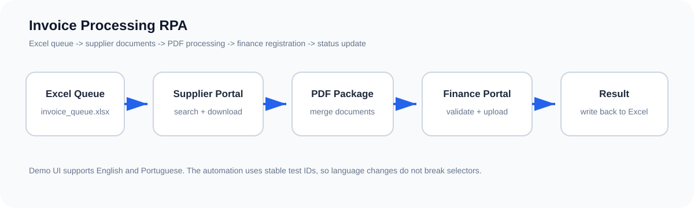

# Invoice Processing RPA

[English](README.md)

Projeto de RPA que simula uma rotina de Contas a Pagar entre dois sistemas empresariais fictícios.

Todas as empresas, credenciais, registros e documentos usados neste repositório são fictícios.



# Fluxo

1. Lê as notas pendentes em uma fila no Excel.
2. Acessa o **Portal de Fornecedores** e pesquisa a nota.
3. Baixa o primeiro e o último documento disponível.
4. Une os dois arquivos em um único PDF.
5. Acessa o **Portal Financeiro** e pesquisa o pedido de compra.
6. Confere se a nota já foi cadastrada.
7. Envia o PDF e salva o registro.
8. Grava o resultado no Excel.

A demonstração também possui casos como pedido de compra inexistente e tipo de nota que precisa de revisão manual.

# Como rodar

Abra um terminal dentro da pasta do projeto e execute:

```bash
py start.py
```

Na primeira execução, o projeto cria o ambiente Python local e instala automaticamente o que precisa. Nas próximas vezes, o mesmo comando inicia a demonstração diretamente.

Os sistemas abrem em inglês por padrão e as mensagens do terminal ficam em português.

Comandos opcionais:

```bash
py start.py --speed 900
py start.py --pt
```

`--speed 900` deixa o navegador mais lento para gravações. `--pt` abre os sistemas da demonstração em português.

# Arquivos do projeto

```text
invoice-processing-rpa/
├── start.py                 # inicia o projeto e prepara a primeira execução
├── main.py                  # fluxo principal do RPA
├── demo_server.py           # portais fictícios de fornecedor e financeiro
├── run_demo.py              # inicia os portais e a automação
├── reset_demo.py            # restaura os dados da demonstração
├── data/
│   └── invoice_queue.xlsx   # fila de notas
├── sample_documents/        # PDFs fictícios
├── docs/
│   └── architecture.svg     # diagrama do fluxo
└── runtime/                 # arquivos criados durante a execução
```

# Cenários da demonstração

- `INV-1001`: nota de serviço processada com sucesso
- `INV-1002`: nota de produto processada com sucesso
- `INV-1003`: pedido de compra não encontrado
- `INV-1004`: reembolso de despesas processado com sucesso
- `INV-1005`: tipo de nota sem mapeamento automático

# Tecnologias

- Python
- Playwright
- OpenPyXL
- pypdf

# Credenciais da demonstração

| Sistema | Usuário | Senha |
| --- | --- | --- |
| Portal de Fornecedores | `supplier.demo` | `demo123` |
| Portal Financeiro | `finance.demo` | `demo123` |
